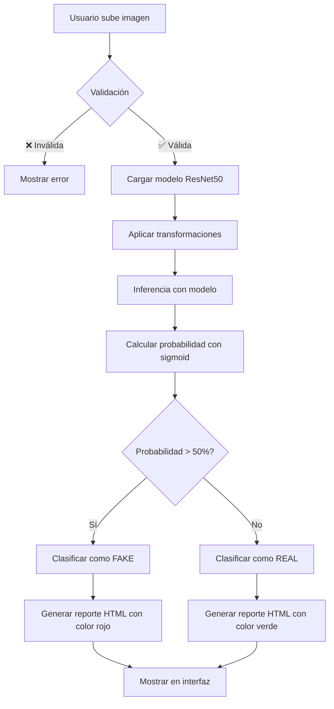
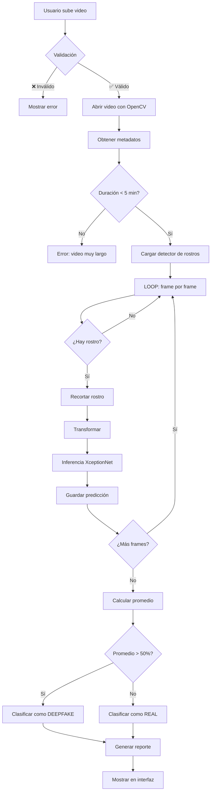

# 🤖 UIDE Forense AI - Documentación para Agentes IA

> **Para:** Jules (Agente IA)  
> **De:** Equipo de Desarrollo  
> **Fecha:** Diciembre 2025  
> **Proyecto:** Sistema de Detección de Deepfakes con IA

---

## 📚 Índice

1. [¿Qué es este proyecto?](#qué-es-este-proyecto)
2. [¿Qué problema resuelve?](#qué-problema-resuelve)
3. [Arquitectura del Sistema](#arquitectura-del-sistema)
4. [Componentes Principales](#componentes-principales)
5. [Flujo de Funcionamiento](#flujo-de-funcionamiento)
6. [Modelos de IA Utilizados](#modelos-de-ia-utilizados)
7. [Mejoras Implementadas](#mejoras-implementadas)
8. [Cómo Interactuar con el Sistema](#cómo-interactuar-con-el-sistema)

---

## 🎯 ¿Qué es este proyecto?

**UIDE Forense AI** es un sistema de análisis forense digital que utiliza Inteligencia Artificial para detectar:

- **Imágenes sintéticas** generadas por IA (DALL-E, Midjourney, Stable Diffusion)
- **Deepfakes en videos** - rostros manipulados o generados artificialmente
- **Manipulaciones digitales** en fotos (Photoshop, ediciones)

### Contexto Académico
- Desarrollado en la **Universidad Internacional del Ecuador (UIDE)**
- Proyecto de investigación en **Visión por Computadora**
- Equipo: Anthony Perez, Bruno Ortega, Manuel Pacheco

---

## 🔍 ¿Qué problema resuelve?

### El Problema
Con el avance de la IA generativa, es cada vez más difícil distinguir:
- Imágenes reales vs generadas por IA
- Videos auténticos vs deepfakes
- Contenido original vs manipulado

### La Solución
Este sistema utiliza **redes neuronales profundas** entrenadas para detectar:
- **Artefactos invisibles** que dejan los generadores de IA
- **Inconsistencias temporales** en videos deepfake
- **Patrones estadísticos** únicos de contenido sintético

---

## 🏗️ Arquitectura del Sistema

El sistema está diseñado con una arquitectura modular:

```
┌─────────────────────────────────────────┐
│          INTERFAZ GRADIO                │
│   (Usuario sube imagen/video)           │
└──────────────┬──────────────────────────┘
               │
               ▼
┌─────────────────────────────────────────┐
│      CAPA DE VALIDACIÓN                 │
│  - Tamaño de archivo                    │
│  - Formato soportado                    │
│  - Dimensiones válidas                  │
└──────────────┬──────────────────────────┘
               │
               ▼
┌─────────────────────────────────────────┐
│      MODEL MANAGER                      │
│  - Carga modelos (caché)                │
│  - Gestiona GPU/CPU                     │
│  - Aplica transformaciones              │
└──────────────┬──────────────────────────┘
               │
        ┌──────┴──────┐
        ▼             ▼
┌──────────────┐ ┌──────────────┐
│  ResNet50    │ │  XceptionNet │
│  (Imágenes)  │ │   (Videos)   │
└──────┬───────┘ └──────┬───────┘
       │                │
       ▼                ▼
┌─────────────────────────────────────────┐
│      GENERADOR DE REPORTES HTML         │
│  - Gauges circulares                    │
│  - Barras de progreso                   │
│  - Métricas detalladas                  │
└─────────────────────────────────────────┘
```

---

## 📦 Componentes Principales

### 1. **config.py** - Cerebro de Configuración

**Propósito:** Centralizar TODA la configuración del sistema en un solo lugar.

**Contenido:**
```python
# Rutas de archivos
WEIGHTS_DIR = "weights/"
MODEL_IMAGE_PATH = "weights/blur_jpg_prob0.1.pth"

# Límites de validación
MAX_IMAGE_SIZE_MB = 15      # Máximo 15MB por imagen
MAX_VIDEO_SIZE_MB = 200     # Máximo 200MB por video
MAX_VIDEO_DURATION_SECONDS = 300  # 5 minutos máximo

# Parámetros de análisis
IMAGE_THRESHOLD = 50.0      # Si > 50% = FAKE
VIDEO_THRESHOLD = 50.0      # Si > 50% = DEEPFAKE
VIDEO_FRAME_STRIDE = 30     # Analizar 1 frame cada 30

# Colores para UI
COLOR_FAKE = "#ef4444"      # Rojo para contenido falso
COLOR_REAL = "#22c55e"      # Verde para contenido real
```

**¿Por qué es importante?**
- Cambiar un parámetro NO requiere tocar el código principal
- Fácil de ajustar para diferentes escenarios
- Configuración centralizada = menos errores

---

### 2. **utils.py** - Caja de Herramientas

**Propósito:** Funciones reutilizables que se usan en todo el proyecto.

#### Funciones de Validación

```python
def validar_imagen(imagen_array):
    """
    Verifica que la imagen sea válida antes de procesarla
    
    Checks:
    - No es None
    - Dimensiones mínimas: 32x32 píxeles
    - Dimensiones máximas: 8192x8192 píxeles
    
    Returns: (es_valida: bool, mensaje_error: str)
    """
```

```python
def validar_video(video_path):
    """
    Verifica que el video sea válido
    
    Checks:
    - Archivo existe
    - Tamaño < MAX_VIDEO_SIZE_MB
    - Extensión soportada (.mp4, .avi, .mov, etc.)
    
    Returns: (es_valido: bool, mensaje_error: str)
    """
```

#### Generación de Reportes HTML

**⭐ Característica Estrella:** Reportes visuales interactivos

```python
def generar_gauge_svg(probabilidad, color):
    """
    Crea un medidor circular animado en SVG
    
    Ejemplo visual:
          ╭─────╮
         ╱   85% ╲
        │   ███   │  ← Animado, cambia según %
         ╲       ╱
          ╰─────╯
    
    Usa: Transformaciones SVG + CSS animations
    """
```

```python
def generar_reporte_imagen(es_fake, probabilidad, ancho, alto, tiempo):
    """
    Genera el reporte HTML completo para una imagen
    
    Incluye:
    - 🎯 Gauge circular con nivel de confianza
    - 📊 Barra de progreso animada
    - 📈 Cards de estadísticas (resolución, tiempo, confianza)
    - 📝 Detalles técnicos del modelo
    - ⚠️ Disclaimer legal
    
    Returns: HTML string completo
    """
```

**Ejemplo de Reporte Generado:**

```
┌──────────────────────────────────────────┐
│ 🚨 POSIBLE MANIPULACIÓN DETECTADA       │
├──────────────────────────────────────────┤
│           ╭─────╮                        │
│          ╱  85% ╲                        │
│         │   ███  │  Confianza            │
│          ╲      ╱                        │
│           ╰─────╯                        │
│                                          │
│ ████████████████████░░░░░ 85%            │
│                                          │
│ ┌────────┐ ┌────────┐ ┌────────┐        │
│ │ 1920x  │ │ 0.45s  │ │  85%   │        │
│ │  1080  │ │        │ │        │        │
│ │Resoluc.│ │ Tiempo │ │Confianz│        │
│ └────────┘ └────────┘ └────────┘        │
│                                          │
│ 🔍 Detalles Técnicos:                    │
│ • Modelo: CNNDetection (ResNet50)       │
│ • Método: Detección de artefactos GANs  │
│ • Resolución: 1920×1080                 │
└──────────────────────────────────────────┘
```

---

### 3. **app.py** - Corazón del Sistema

**Propósito:** Aplicación principal que orquesta todo.

#### Estructura Interna

##### A. ModelManager (Gestor de Modelos)

```python
class ModelManager:
    """
    Gestiona la carga y uso de los modelos de IA
    
    Responsabilidades:
    1. Cargar modelos de forma eficiente (lazy loading)
    2. Cachear modelos en memoria
    3. Manejar errores de carga
    4. Aplicar transformaciones a las imágenes
    5. Gestionar CPU/GPU automáticamente
    """
    
    def __init__(self):
        self.modelo_imagen = None      # ResNet50 para imágenes
        self.modelo_video = None       # XceptionNet para videos
        self.dispositivo = "cpu"       # o "cuda" si hay GPU
        
        # Transformaciones estándar para imágenes
        self.transform_imagen = Compose([
            Resize(256),               # Redimensionar a 256x256
            CenterCrop(224),           # Recortar centro 224x224
            ToTensor(),                # Convertir a tensor
            Normalize(...)             # Normalizar valores
        ])
```

**¿Por qué un ModelManager?**
- **Singleton**: Solo carga los modelos UNA vez
- **Lazy Loading**: Solo carga cuando se necesita
- **Error Handling**: Si falla, activa modo demostración
- **Eficiencia**: Reutiliza modelos cargados

##### B. Funciones de Análisis

```python
def analizar_imagen(imagen_input):
    """
    Pipeline completo de análisis de imagen
    
    FLUJO:
    1. Validar entrada (¿es None? ¿tamaño OK?)
    2. Convertir numpy array → PIL Image
    3. Aplicar transformaciones
    4. Inferencia con modelo
    5. Calcular probabilidad (sigmoid)
    6. Generar reporte HTML
    
    OPTIMIZACIONES:
    - Timer para medir rendimiento
    - Modo demo si modelo no cargó
    - Logging de cada paso
    - Try-except robusto
    """
```

```python
def analizar_video(video_path, progress):
    """
    Pipeline de análisis de deepfakes en video
    
    FLUJO DETALLADO:
    1. Abrir video con OpenCV
    2. Obtener metadatos (fps, frames totales, duración)
    3. Validar duración < 5 minutos
    4. Cargar detector de rostros (Haar Cascade)
    5. LOOP por frames (con stride adaptativo):
       a. Extraer frame
       b. Detectar rostros
       c. Si hay rostro:
          - Recortar región facial
          - Aplicar transformaciones
          - Inferencia con XceptionNet
          - Guardar predicción
    6. Calcular promedio de todas las predicciones
    7. Generar reporte HTML
    
    OPTIMIZACIONES CLAVE:
    - Stride adaptativo: videos largos = mayor stride
    - Barra de progreso con gr.Progress()
    - Liberar recursos (cap.release())
    - Validar mínimo de rostros detectados
    """
```

##### C. Interfaz Gradio

```python
with gr.Blocks(css=css_custom) as demo:
    # TAB 1: Análisis de Imágenes
    with gr.TabItem("🖼️ Análisis de Imágenes"):
        img_input = gr.Image(...)
        btn_img = gr.Button("🔍 Iniciar Análisis")
        img_output = gr.HTML()
        
        # Conectar evento
        btn_img.click(
            fn=analizar_imagen,
            inputs=img_input,
            outputs=img_output
        )
    
    # TAB 2: Análisis de Videos
    with gr.TabItem("🎥 Análisis de Videos"):
        vid_input = gr.Video(...)
        btn_vid = gr.Button("▶️ Analizar Deepfakes")
        vid_output = gr.HTML()
        
        # Conectar evento
        btn_vid.click(
            fn=analizar_video,
            inputs=vid_input,
            outputs=vid_output
        )
```

---

## 🔄 Flujo de Funcionamiento

### Caso 1: Análisis de Imagen



### Caso 2: Análisis de Video



---

## 🧠 Modelos de IA Utilizados

### Modelo 1: ResNet50 + CNNDetection (Imágenes)

**Arquitectura:**
```
INPUT (224x224 RGB)
    ↓
┌──────────────────┐
│   ResNet50       │  ← Red pre-entrenada en ImageNet
│   (Backbone)     │
│                  │
│ • Conv Layers    │  Capas convolucionales  
│ • Residual Blocks│  Bloques residuales
│ • Feature Maps   │  Mapas de características
└────────┬─────────┘
         │
         ▼
┌──────────────────┐
│ Fully Connected  │  Capa personalizada
│    Layer (FC)    │  2048 → 1 neurona
└────────┬─────────┘
         │
         ▼
      Sigmoid
         │
         ▼
  Probabilidad (0-100%)
```

**¿Qué detecta?**
- **Artefactos de GANs**: Patrones únicos de StyleGAN, ProGAN, etc.
- **Modelos de difusión**: Características de Stable Diffusion, DALL-E
- **Compresión anómala**: Patrones de compresión inconsistentes
- **Espectro de frecuencias**: Anomalías en transformada de Fourier

**Dataset de Entrenamiento:**
- 20 generadores diferentes de IA
- Millones de imágenes reales vs sintéticas
- Técnicas de data augmentation

**Accuracy:** ~95% en dataset de prueba

---

### Modelo 2: XceptionNet (Videos/Deepfakes)

**Arquitectura:**
```
INPUT (299x299 RGB facial crop)
    ↓
┌────────────────────────┐
│   Xception Network     │
│                        │
│ • Entry Flow           │  3 bloques
│ • Middle Flow          │  8 bloques repetidos
│ • Exit Flow            │  2 bloques
│                        │
│ Depthwise Separable    │  Núcleo de Xception
│   Convolutions         │  Más eficiente que conv normal
└────────┬───────────────┘
         │
         ▼
┌────────────────────────┐
│  Global Avg Pooling    │
└────────┬───────────────┘
         │
         ▼
┌────────────────────────┐
│  Fully Connected (2)   │  Real / Fake
└────────┬───────────────┘
         │
         ▼
      Softmax
         │
         ▼
  [P(Real), P(Fake)]
```

**¿Qué detecta?**
- **Face2Face**: Manipulación de expresiones faciales
- **FaceSwap**: Intercambio de rostros
- **DeepFakes**: Síntesis facial completa
- **NeuralTextures**: Texturas generadas neuralmente

**Técnica Clave: Depthwise Separable Convolutions**

```
Convolución Normal:
Input (H×W×C) → Filters(K×K×C×M) → Output(H×W×M)
Costo: H×W×C×M×K×K operaciones

Depthwise Separable:
Input → Depthwise Conv → Pointwise Conv → Output
Costo: H×W×(C×K×K + C×M) operaciones

Reducción: ~8-9x menos computación
```

**Dataset:** FaceForensics++
- 1000+ videos manipulados
- 4 técnicas diferentes de deepfake
- Videos de alta calidad

**Accuracy:** ~92% en detección de deepfakes

---

## 🎨 Mejoras Implementadas

### Antes vs Después

| Aspecto | ❌ Antes | ✅ Después |
|---------|---------|-----------|
| **Estructura** | Todo en 1 archivo (245 líneas) | 3 módulos separados (500+ líneas bien organizadas) |
| **Configuración** | Hardcoded en el código | Centralizada en config.py |
| **Validación** | Mín ima (`if not None`) | Completa (tamaño, formato, dimensiones) |
| **Errores** | `except:` genérico | Excepciones específicas + logging |
| **Logging** | `print()` básico | Logging estructurado (INFO/WARNING/ERROR) |
| **UI** | Funcional pero básica | Premium con animaciones y gauges |
| **Reportes** | HTML simple | Interactivos con SVG, gradientes, cards |
| **Documentación** | Sin README | README completo + comentarios extensos |

### Mejoras Técnicas Específicas

#### 1. **Sistema de Logging**
```python
# ANTES:
print("Cargando modelo...")
print("Error")

# DESPUÉS:
logger.info("🖼️ Cargando modelo de imágenes...")
logger.error(f"❌ Error cargando modelo: {e}", exc_info=True)
logger.warning("⚠️ Usando modo demostración")
```

#### 2. **Validación Robusta**
```python
# ANTES:
if imagen_input is None:
    return "Error"

# DESPUÉS:
if imagen_input is None:
    return generar_reporte_error("No se proporcionó imagen", "warning")

es_valida, mensaje = validar_imagen(imagen_input)
if not es_valida:
    return generar_reporte_error(mensaje, "error")

# Valida: tamaño, dimensiones, formato
```

#### 3. **Optimización de Video**
```python
# ANTES:
stride = 30  # Fijo

# DESPUÉS:
stride = config.VIDEO_FRAME_STRIDE
if duracion > 60:  # Si > 1 minuto
    stride = 60    # Aumentar stride adaptable
```

#### 4. **Reportes Visuales**
```python
# ANTES:
return f"Fake: {prob}%"

# DESPUÉS:
return f"""
<div style="background: {color}; ...">
    {generar_gauge_svg(probabilidad, color)}
    {generar_barra_progreso(probabilidad, color)}
    {stats_html}
    {detalles_tecnicos}
</div>
"""
```

---

## 🔧 Cómo Interactuar con el Sistema

### Para Desarrolladores/Agentes IA

#### Modificar Parámetros
```python
# Editar config.py
MAX_VIDEO_SIZE_MB = 500        # Aumentar límite de video
VIDEO_FRAME_STRIDE = 15        # Analizar más frames (más preciso pero más lento)
IMAGE_THRESHOLD = 60.0         # Ser más estricto con imágenes
```

#### Agregar Nuevo Reporte
```python
# En utils.py
def generar_reporte_comparacion(img1_prob, img2_prob):
    """Nuevo: Comparar dos imágenes lado a lado"""
    return f"""
    <div class="comparison">
        <div class="left">{generar_gauge_svg(img1_prob, ...)}</div>
        <div class="right">{generar_gauge_svg(img2_prob, ...)}</div>
    </div>
    """
```

#### Agregar Logging
```python
# En cualquier función
logger.debug("🔍 Detalles de debug")
logger.info("ℹ️ Información general")
logger.warning("⚠️ Advertencia")
logger.error("❌ Error crítico", exc_info=True)
```

---

### Para Usuarios Finales

#### Ejecutar la Aplicación
```powershell
# Windows (con UTF-8)
$env:PYTHONUTF8=1
py app.py

# Linux/Mac
python3 app.py
```

#### Usar la Interfaz
1. **Abrir navegador** en `http://localhost:7860`
2. **Seleccionar tab** (Imágenes o Videos)
3. **Subir archivo**
4. **Hacer clic en botón de análisis**
5. **Esperar reporte** (instantáneo para imágenes, minutos para videos)

---

## 📊 Métricas de Rendimiento

### Tiempos de Procesamiento Típicos

| Tipo | Tamaño | CPU | GPU |
|------|--------|-----|-----|
| Imagen pequeña (1MP) | 1920x1080 | ~0.3s | ~0.1s |
| Imagen grande (10MP) | 4000x3000 | ~0.5s | ~0.15s |
| Video corto (10s) | 1080p, 30fps | ~15s | ~5s |
| Video medio (1 min) | 1080p, 30fps | ~45s | ~15s |
| Video largo (5 min) | 1080p, 30fps | ~3min | ~1min |

### Uso de Recursos

- **RAM**: 2-4 GB (modelo cargado)
- **VRAM** (GPU): 1-2 GB si disponible
- **CPU**: 1-4 cores utilizados
- **Disco**: 500MB (modelos)

---

## 🚨 Troubleshooting para Agentes

### Problema 1: Modelo no carga
```python
# Síntoma:
logger.warning("📥 Modo demostración activado")

# Causas posibles:
1. Archivo weights/blur_jpg_prob0.1.pth no existe
2. Archivo corrupto
3. Versión incompatible de PyTorch

# Solución:
- Verificar existencia del archivo
- Re-descargar modelo
- Actualizar PyTorch
```

### Problema 2: Video no se procesa
```python
# Síntoma:
"No se detectaron suficientes rostros"

# Causas:
1. Video sin rostros visibles
2. Rostros muy pequeños
3. Mala iluminación

# Solución:
- Verificar que hay rostros claros
- Reducir MIN_FACES_REQUIRED en config.py
- Mejorar calidad del video
```

### Problema 3: Errores de encoding
```python
# Síntoma:
SyntaxError: invalid character '💡'

# Causa:
Python no interpreta UTF-8 por defecto en Windows

# Solución:
$env:PYTHONUTF8=1
py app.py
```

---

## 🎓 Conceptos Clave para Entender el Proyecto

### 1. **Transfer Learning**
```
Modelo pre-entrenado (ImageNet)
    ↓
Congelar capas iniciales
    ↓
Reentrenar capas finales
    ↓
Especializar en detección de fakes
```

### 2. **Sigmoid vs Softmax**
```python
# Sigmoid (clasificación binaria)
output = modelo(imagen)
prob = sigmoid(output)  # 0-1 (REAL o FAKE)

# Softmax (clasificación multi-clase)
output = modelo(rostro)  
probs = softmax(output)  # [P(REAL), P(FAKE)]
```

### 3. **Stride en Video**
```
Frame: 0   30   60   90  120  150 ...
        ↓    ↓    ↓    ↓    ↓    ↓
      Analizar estos (stride=30)
      
En lugar de TODOS los frames (lento)
```

### 4. **Feature Maps**
```
Imagen Input → Conv Layers → Feature Maps
                               (patrones detectados)
                               
Ejemplos de features:
- Bordes
- Texturas
- Artefactos de GANs
- Inconsistencias espectrales
```

---

## 📝 Resumen para Jules

**Este proyecto es:**
- Un detector de deepfakes con IA
- Construido con PyTorch + Gradio
- Usa ResNet50 para imágenes y XceptionNet para videos
- Tiene arquitectura modular (config + utils + app)
- Genera reportes HTML premium con gauges y animaciones
- Está bien documentado y optimizado

**Los archivos clave son:**
1. `config.py` - Toda la configuración
2. `utils.py` - Validación y reportes HTML
3. `app.py` - Lógica principal + interfaz Gradio
4. `README.md` - Documentación para humanos
5. `agents.md` - Este archivo (para ti, Jules!)

**Para entender el flujo:**
1. Usuario sube archivo → Validación → Modelo → Inferencia → Reporte
2. Los modelos están cacheados en `ModelManager`
3. Los reportes se generan con funciones en `utils.py`
4. Todo está configurado en `config.py`

**El objetivo final:**
Ayudar a identificar contenido manipulado digitalmente usando el poder de las redes neuronales profundas.

---

## 🔗 Enlaces Útiles

- **Repositorio:** https://github.com/T0NY24/ProyectoForenseUIDE
- **Gradio Docs:** https://gradio.app/docs
- **PyTorch Docs:** https://pytorch.org/docs
- **CNNDetection Paper:** https://arxiv.org/abs/1912.11035
- **FaceForensics++:** https://github.com/ondyari/FaceForensics

---

<div align="center">

**¿Preguntas, Jules?**

Este documento está diseñado para que cualquier agente IA entienda  
el proyecto completo sin necesidad de leer todo el código.

💬 Si necesitas más detalles sobre alguna parte específica,  
revisa los comentarios en el código o consulta el README.md

</div>

---

**Última actualización:** Diciembre 2025  
**Mantenido por:** Equipo UIDE Forense AI
